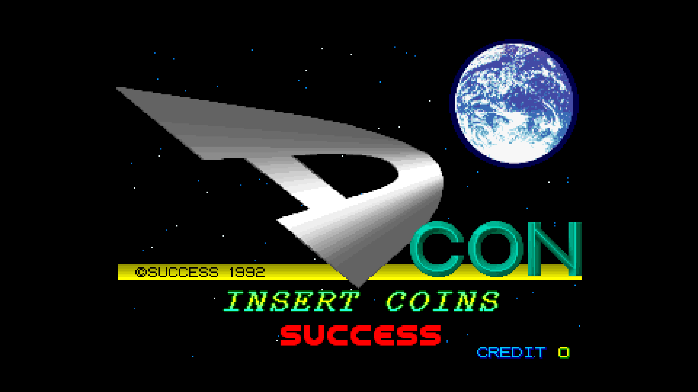
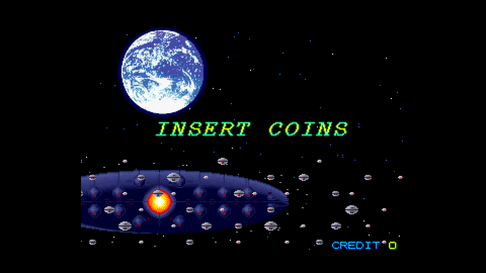
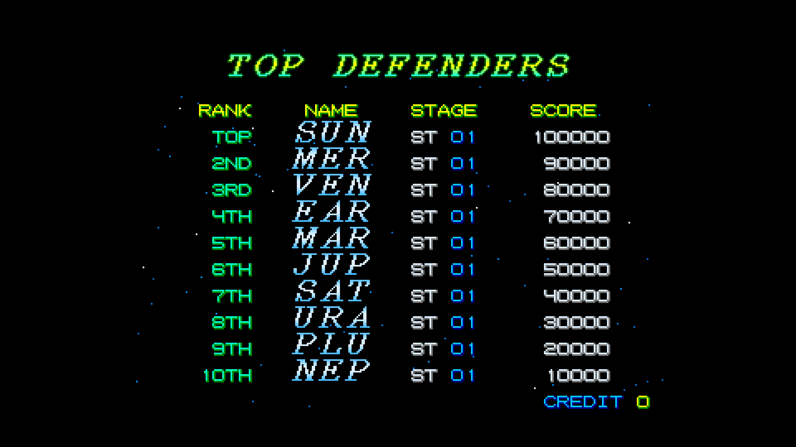
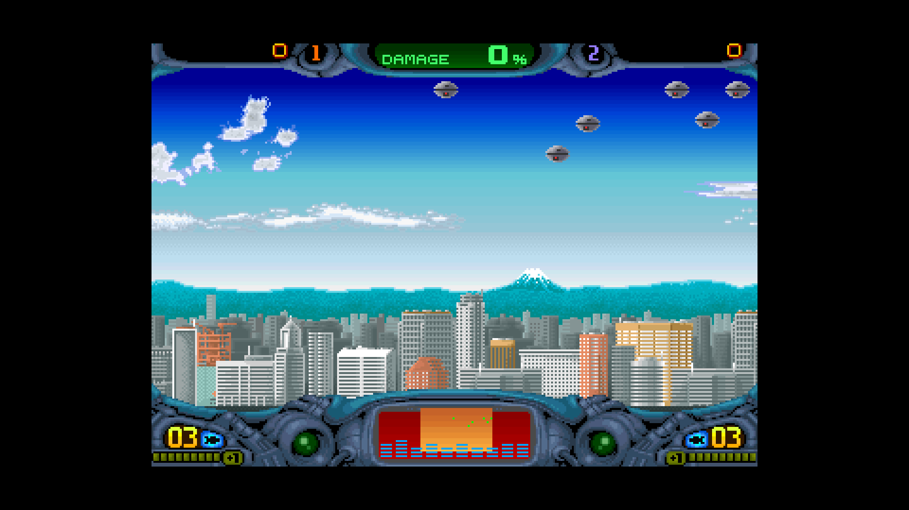
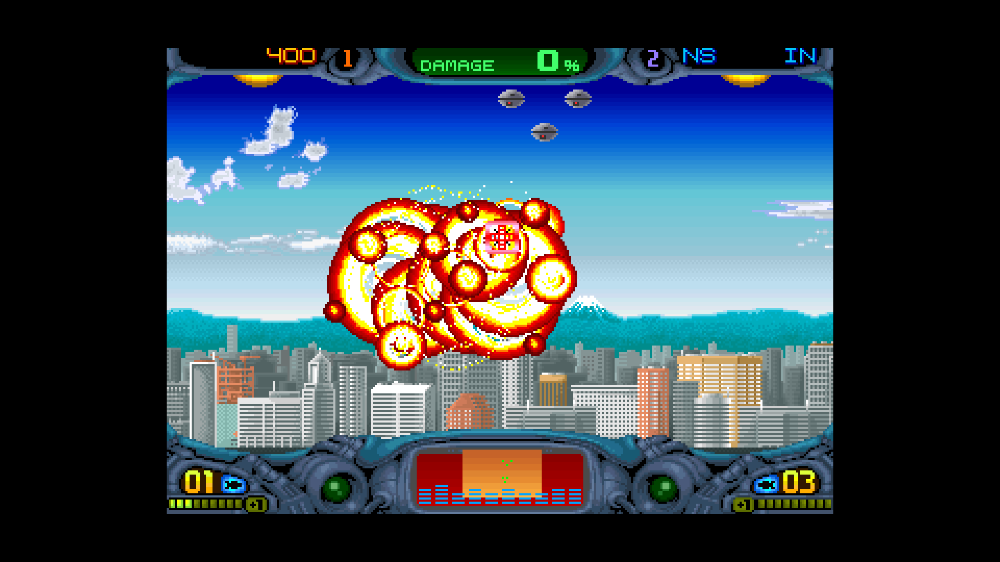
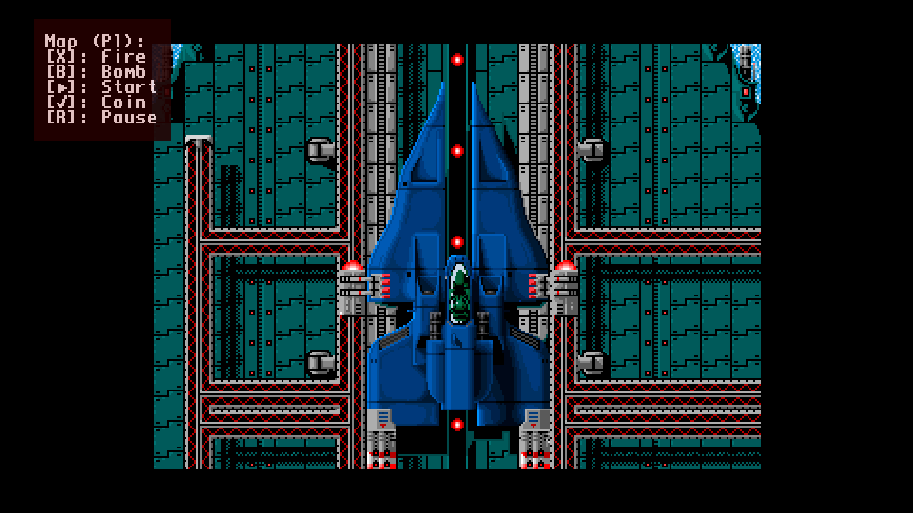

-=(DCon_Senhor notes)=-

Tested: Working Video 720p, 1080p & Sound.

___
# Arcade-DCon_MiSTer

FPGA core for **D-Con** (Success, 1992) targeting the
[MiSTer FPGA](https://github.com/MiSTer-devel) platform (Terasic DE10-Nano).

D-Con is a vertical/horizontal shoot-em-up running on **Seibu hardware**
similar to *Blood Bros.*

## Status

**Current version: 1.0** (May 2026) — first public release.

The core runs the full game with audio and inputs.

**Features**
- M68000 main CPU @ 10 MHz (FX68K cycle-accurate)
- Z80 sound CPU @ 4 MHz (T80s)
- YM3812 OPL2 FM (jtopl2) + OKI M6295 ADPCM (jt6295) with MAME-accurate mixer
- 320×224 active video area (Seibu D-Con timings)
- BG / MG / FG tilemaps (16×16, 4bpp, 32×32 tilemap)
- Text layer (8×8, 4bpp, 64×32 tilemap)
- 16×16 sprites with priority callback (Seibu SEI0211)
- Seibu CRTC registers (scroll, layer enable, flip screen)
- MiSTer OSD with audio mixer (FM/OKI volume), per-layer debug toggles
- Pause overlay with logo + supporters scroll
- Reverse-engineering documentation included in `docs/reverse_engineering/`

**ROM sets supported**
- D-Con (dcon)

## Screenshots

| | |
|---|---|
|  |  |
| Title screen | Attract — Insert Coins |
|  |  |
| Top Defenders ranking | Gameplay — city skyline |
|  |  |
| Gameplay — bomb explosion | Pause overlay with controls map |

## Hardware emulated

| Component        | Spec                                                |
|------------------|-----------------------------------------------------|
| Master clock     | 20 MHz crystal (main) + 14.31818 MHz (sound)        |
| Main CPU         | M68000 @ 10 MHz                                     |
| Sound CPU        | Z80 @ 4 MHz                                         |
| Sound chip 1     | Yamaha YM3812 OPL2 (jtopl2)                         |
| Sound chip 2     | OKI M6295 (jt6295) ADPCM, pin7=LOW, 1.32 MHz        |
| Video resolution | 320×224 active                                      |
| Refresh rate     | ~59.4 Hz                                            |
| BG layer         | 16×16 4bpp, 32×32 tilemap, scroll X/Y               |
| MG layer         | 16×16 4bpp, 32×32 tilemap, scroll X/Y               |
| FG layer         | 16×16 4bpp, 32×32 tilemap, scroll X/Y               |
| Text layer       | 8×8 4bpp, 64×32 tilemap                             |
| Sprites          | 16×16 4bpp, 4-level priority (Seibu SEI0211)        |
| Palette          | xBGR_555, 2048 entries                              |
| Custom video CRTC| Seibu CRTC (legionna.cpp / seibu_crtc.cpp)          |
| Sprite chip      | Seibu SEI0211                                       |

## Hardware requirements

- Terasic DE10-Nano
- MiSTer I/O board (recommended)
- Works on HDMI displays and on 15 kHz CRTs via the analog video output

## Building from source

Requires Quartus Prime 17.0 (free Lite Edition).

```
Open DCon.qpf in Quartus → Processing → Start Compilation
```

Output bitstream is generated in `output_files/DCon.rbf` (~3.9 MB).

## Running on MiSTer

The [releases/](releases/) folder contains the parent MRA and a
prebuilt RBF:

- `D-Con.mra` — parent MRA
- `DCon_YYYYMMDD.rbf` — prebuilt bitstream

Steps:

1. Copy the `.rbf` to `_Arcade/cores/` on the MiSTer SD card (rename to
   `DCon.rbf` or keep the dated name and update the MRA accordingly).
2. Copy the `.mra` file to `_Arcade/` on the MiSTer SD card.
3. Provide your legally-owned `dcon.zip` ROM where the MRA expects it
   (usually in `games/mame/`).

**ROMs are NOT included in this repository.** You must provide them yourself.

## Repository layout

```
Arcade-DCon_MiSTer/
├── rtl/
│   ├── DCon/         D-Con-specific core RTL
│   ├── pll/          Clock PLL
│   ├── sound/        Sound chip cores (jtopl, jt6295, t80)
│   ├── fx68k/        FX68K M68000 cycle-accurate core
│   ├── jtframe/      JTFRAME framework modules
│   └── sdram.sv      SDRAM controller (Sorgelig)
├── sys/              MiSTer framework (Sorgelig / MiSTer-devel)
├── logo/             Pause overlay assets (font, logo, supporter list)
├── docs/             Documentation
│   └── reverse_engineering/  Main 68K disassembly + analysis
├── releases/         Parent MRA + prebuilt RBF
├── DCon.qpf          Quartus project
├── DCon.qsf          Quartus assignments
├── DCon.sv           Top-level wrapper
├── Template.sdc      Timing constraints
├── files.qip         HDL file list
├── build_id.v        Build version stamp
└── README.md         This file
```

## Acknowledgements

- **Jose Tejada** ([@jotego](https://github.com/jotego)) for JTOPL (YM3812),
  JT6295 (OKI M6295) and the JTFRAME framework.
- **Daniel Wallner** and **MikeJ** for the T80 (Z80) core.
- **Frederic Requin** and contributors for the **FX68K** cycle-accurate
  M68000 core.
- **Sorgelig** and the **MiSTer-devel team** for the framework, SDRAM
  controller and Template.
- The **MAME** project for invaluable hardware reference
  (`seibu/dcon.cpp`, `seibu/seibu_crtc.cpp`).

## Support this project

If you enjoy this core and want to support its development:

- [Ko-fi](https://ko-fi.com/ibecerivideoludici) — one-time support
- [Patreon](https://www.patreon.com/IBeceriVideoludici) — monthly support
- [PayPal](https://www.paypal.me/IBeceriVideoludici) — one-time donation

## Follow

- [GitHub](https://github.com/rmonic79)
- [Twitch](https://twitch.tv/ibecerivideoludici) — live streams
- [YouTube](https://www.youtube.com/c/IBeceriVideoludici) — playlists and videos
- [X / Twitter](https://x.com/rmonic79)

## License

The RTL source code in this repository is provided as-is for educational
and preservation purposes under **GNU GPL v3 or later**. Original ROM data
is not included; users must provide their own legally obtained copies.

Original *D-Con* arcade hardware © Success, 1992.
